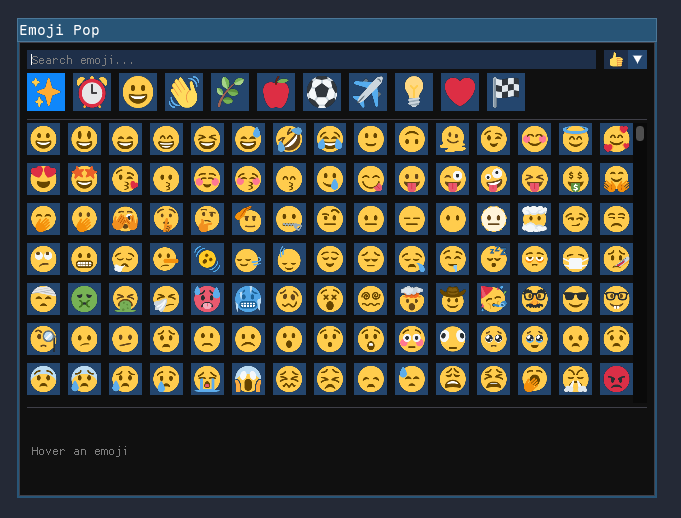

# emoji pop

A Linux emoji picker that opens instantly.

<p align="center">
  
</p>

## Build

```bash
cmake -B build
cmake --build build
```

Requires OpenGL, FreeType, and HarfBuzz.

## Usage flow

1. Bind a shortcut in your WM/DE (Super/Mod + . recommended).
2. Press your shortcut to launch. Escape to hide.
3. Search by name or keyword.
4. Select an emoji — copied to clipboard, window dismisses.

### i3

Add to `~/.config/i3/config`:

```
bindsym $mod+period exec --no-startup-id emoji_pop
for_window [class="Emoji Pop"] floating enable, move position center, resize set 640 480
```
